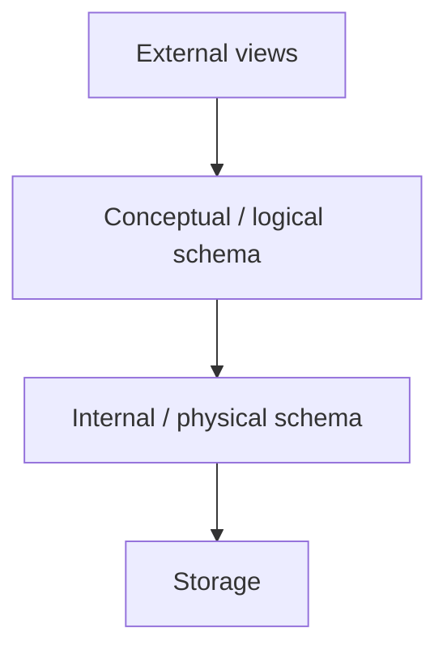
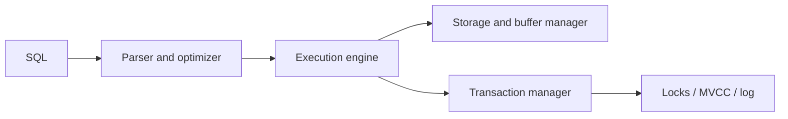

# 01. DBMS Fundamentals and Architecture

> Placement revision sheet: understand what a DBMS guarantees, how its major components cooperate, and where common definitions are misleading.

## Mental model

A DBMS stores and retrieves data while providing:

- A data model and query language
- Constraints and controlled redundancy
- Concurrent access with isolation
- Recovery after failures
- Security and access control
- Efficient storage, indexing and query execution

The application states **what** data it needs; the DBMS chooses much of **how** to access it.

## DBMS vs file system

| File-based application | DBMS |
|---|---|
| Application defines file format/access | Data model and query interface |
| Integrity rules duplicated in code | Declarative constraints |
| Manual concurrency coordination | Transactions and concurrency control |
| Manual crash recovery | Logging, recovery and backups |
| Limited ad-hoc querying | Optimized declarative queries |
| Simple and low overhead for narrow tasks | More operational and runtime complexity |

A DBMS is not automatically the best choice for every file. Configuration, logs and immutable blobs may fit ordinary/object storage better.

## DBMS vs RDBMS

- **DBMS** is the broad category: relational, document, key-value, graph and others.
- **RDBMS** uses the relational model: relations, tuples, attributes, keys and relational operations.
- SQL is strongly associated with relational systems, but products vary in standards and extensions.

## Three-schema architecture

- **External level:** user/application-specific views.
- **Conceptual level:** global logical structure, entities, relations and constraints.
- **Internal level:** pages, files, indexes, encodings and placement.

### Data independence

- **Physical data independence:** change storage/indexes without changing logical schema/application meaning.
- **Logical data independence:** change logical schema while preserving external views/program interfaces.
- Logical independence is generally harder because applications depend on structure and meaning.

## Schema, instance and metadata

- **Schema:** relatively stable definition of structure and constraints.
- **Instance/state:** data stored at a particular time.
- **Metadata/catalog/data dictionary:** schemas, columns, constraints, indexes, statistics, privileges and other descriptive state.

The optimizer uses catalog statistics; stale statistics can produce poor plans without any SQL syntax error.

## Database languages

| Category | Purpose | Examples |
|---|---|---|
| DDL | Define/alter objects | `CREATE`, `ALTER`, `DROP` |
| DML | Read/change rows | `SELECT`, `INSERT`, `UPDATE`, `DELETE` |
| DCL | Privileges | `GRANT`, `REVOKE` |
| TCL | Transaction boundaries | `COMMIT`, `ROLLBACK`, `SAVEPOINT` |

The exact classification of statements such as `SELECT` or `TRUNCATE` varies across teaching material and products; know behavior rather than memorizing only labels.

## Major DBMS components

- **Parser/binder:** syntax, names, types and permissions.
- **Optimizer:** creates equivalent plans and estimates costs.
- **Execution engine:** runs operators such as scans, joins and aggregates.
- **Storage manager:** pages, files, records and free space.
- **Buffer manager:** caches database pages in memory.
- **Transaction/concurrency manager:** isolation, locks/timestamps/versions.
- **Recovery/log manager:** WAL, commit durability and restart recovery.
- **Catalog/statistics:** object definitions and data-distribution estimates.

## Architecture patterns

- **One-tier:** UI/application/database on one environment; local tools.
- **Two-tier:** client directly connects to database server.
- **Three-tier:** client -> application/API server -> database; common web architecture.

Three-tier architecture centralizes authorization, validation, pooling and business logic. It does not remove the need for database constraints.

## Data models

| Model | Best mental model |
|---|---|
| Relational | Tables plus declarative relationships/constraints |
| Key-value | Lookup by key |
| Document | Nested aggregate/document retrieval |
| Wide-column | Partitioned rows optimized around access patterns |
| Graph | Vertices/edges and traversals |
| Columnar analytical | Scan selected columns over many rows |

## OLTP vs OLAP

| OLTP | OLAP |
|---|---|
| Many short reads/writes | Fewer large scans/aggregations |
| Current operational state | Historical/analytical data |
| Low latency and concurrency | Throughput over large datasets |
| Row-oriented storage common | Column-oriented storage common |
| Normalized schemas common | Star/denormalized models common |

These are workload tendencies, not rigid product categories.

## Row vs column storage

- **Row store:** fields of one row colocated; efficient point reads/inserts/updates.
- **Column store:** values of one column colocated; efficient compression and analytical scans over selected columns.
- “Column family” in a wide-column NoSQL database is not identical to an analytical column-store layout.

## Common traps

- Database and schema have product-specific naming meanings.
- Physical independence does not mean physical design never affects performance.
- Three-tier architecture is deployment structure, not the three-schema abstraction model.
- RDBMS does not imply every workload must be normalized fully.
- SQL is declarative, but physical behavior still depends on schema, indexes, statistics and engine.
- Database constraints remain necessary even if the API validates input.

## Interview checks

1. DBMS vs file system: why accept DBMS overhead?
2. Explain the three levels of abstraction.
3. Physical vs logical data independence?
4. Trace a SQL query through major DBMS components.
5. OLTP vs OLAP and row vs column storage?
6. Why can stale statistics cause a slow query?
7. Why should validation exist in both application and database layers?

## 60-second recall

- DBMS = data model + queries + constraints + concurrency + recovery.
- Schema is definition; instance is current data; catalog is metadata.
- External/conceptual/internal levels enable data independence.
- Query processor decides plans; storage/buffer manager moves pages; transaction/log managers protect correctness.
- OLTP favors short concurrent operations; OLAP favors large scans/aggregation.

## References

- [CMU 15-445: Database Systems](https://15445.courses.cs.cmu.edu/fall2025/)
- [GATE 2027 CS syllabus](https://gate2027.iitm.ac.in/static/doc/GATE2027_Syllabus/CS_GATE2027_Syllabus.pdf)

