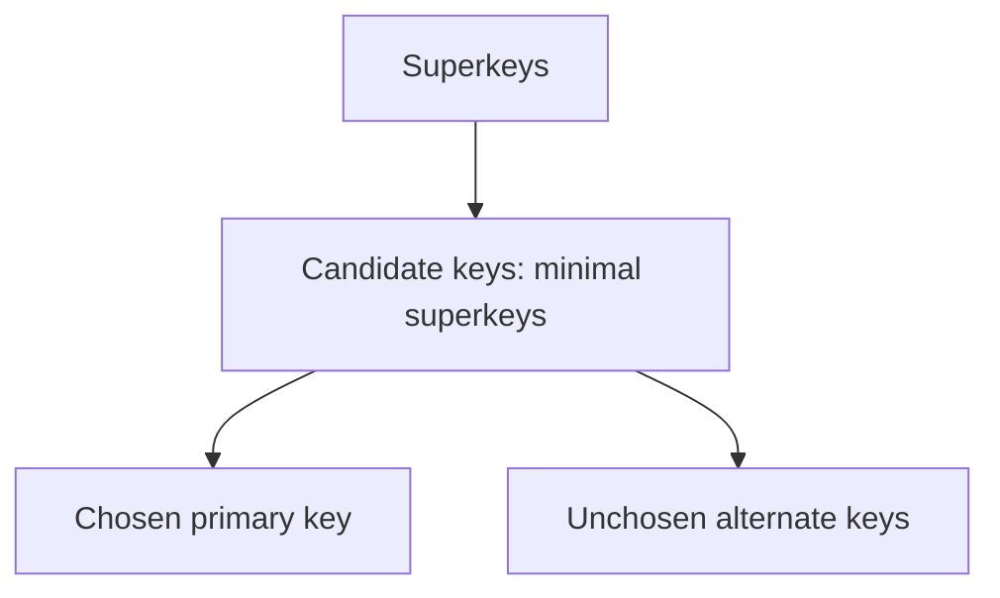

# 03. Relational Model, Keys and Constraints

> The relational model represents data as relations and uses keys/constraints to define valid database states.

## Relational vocabulary

| Formal term | Common SQL term |
|---|---|
| Relation | Table |
| Tuple | Row |
| Attribute | Column |
| Domain | Allowed value set/type |
| Degree | Number of attributes |
| Cardinality | Number of tuples |
| Relation schema | Name plus attributes/domains/constraints |
| Relation instance | Current tuple set |

The pure relational model uses sets with no duplicate tuples or inherent order. SQL commonly uses **bag/multiset semantics** unless `DISTINCT` or a set operator removes duplicates.

## Key hierarchy

- **Superkey:** any attribute set that uniquely identifies tuples; may contain unnecessary attributes.
- **Candidate key:** minimal superkey—remove any attribute and uniqueness is lost.
- **Primary key:** selected candidate key.
- **Alternate key:** candidate key not selected as primary.
- **Composite key:** key containing multiple attributes.
- **Foreign key:** attributes constrained to match a referenced candidate/unique key, subject to product rules and NULL semantics.

## Natural vs surrogate key

| Natural key | Surrogate key |
|---|---|
| Derived from business data | System-generated identifier |
| Can express real-world uniqueness | Stable and compact relationship target |
| May change/be wide/sensitive | Has no business meaning |

A surrogate primary key does not enforce business uniqueness. Add a unique constraint for the natural candidate key where required.

## Integrity constraints

### Domain integrity

Values satisfy type, range, format and allowed-set rules.

### Key constraint

Candidate/unique key values identify at most one tuple.

### Entity integrity

Primary-key attributes cannot be NULL.

### Referential integrity

A non-NULL foreign-key value must reference an allowed parent key.

### Business constraints

`CHECK`, uniqueness, exclusion rules, triggers or controlled transaction logic enforce domain-specific invariants.

## Referential actions

| Action | Parent update/delete behavior |
|---|---|
| RESTRICT / NO ACTION | Reject when dependent rows exist; timing may differ |
| CASCADE | Propagate key update/delete |
| SET NULL | Remove relationship by setting FK NULL |
| SET DEFAULT | Assign configured default if valid |

Use cascading deletes only when dependent lifetime truly belongs to parent. A cascade across a large graph can delete unexpectedly or lock many rows.

## Primary key vs unique constraint

- One primary key designation per table; multiple unique constraints possible.
- Primary key implies NOT NULL.
- Unique-constraint treatment of NULL varies by DBMS and options.
- Both can often be referenced, but engine rules differ.
- Neither is conceptually identical to an index, even when implemented using one.

## NULL and three-valued logic

NULL represents missing/unknown/not-applicable according to schema meaning. Comparisons such as `x = NULL` do not return true; use `IS NULL`.

Predicates evaluate to `TRUE`, `FALSE` or `UNKNOWN`. `WHERE` keeps only `TRUE`. This explains many `NOT IN`, join and check-constraint surprises.

Do not use magic values such as `0`, `-1` or empty string to represent missing data unless they are valid, documented domain values.

## UUID vs auto-increment ID

| Auto-increment | UUID |
|---|---|
| Compact, index-local inserts | Generate independently across systems |
| Exposes approximate order/count | Larger indexes and payloads |
| Coordination required for distributed writers | Random variants can fragment ordered indexes |

Time-ordered identifier variants can improve locality, but identifier choice must consider security, distribution and index behavior.

## Constraint placement

Use the database for invariants that must hold under concurrent writers:

- Unique email/username/idempotency key
- Foreign-key existence
- Valid state ranges
- Nonnegative balances where sufficient

Application validation improves errors and workflows but is race-prone when used as the only enforcement layer.

## Common traps

- Candidate key is minimal; “minimum number of columns” is not the definition.
- Multiple different candidate keys can have different sizes.
- Foreign key is not automatically unique.
- Primary key and clustered index are separate concepts.
- Unique constraints and NULL behavior are product-specific.
- `CHECK (value > 0)` may allow NULL because UNKNOWN is not FALSE in many systems; add `NOT NULL` if required.
- An application “exists?” check followed by insert can race; enforce uniqueness in DB.

## Interview checks

1. Superkey vs candidate key vs primary key?
2. Can a table have multiple candidate keys? Multiple primary keys?
3. Natural vs surrogate keys?
4. Primary key vs unique constraint?
5. Can a foreign key be NULL or reference a unique non-primary column?
6. Explain entity and referential integrity.
7. When is `ON DELETE CASCADE` appropriate or dangerous?
8. Why does application-side uniqueness checking fail under concurrency?
9. Explain SQL NULL in a predicate.

## 60-second recall

- Relation is set-like concept; SQL normally keeps duplicates.
- Candidate key = minimal superkey; primary key = chosen candidate.
- Surrogate ID does not replace business uniqueness.
- PK implies identity/non-NULL; FK enforces allowed references.
- NULL produces three-valued logic; use explicit `IS NULL`.
- Database constraints protect invariants across concurrent applications.

