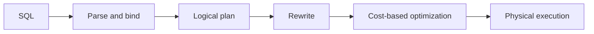

# 10 — Query Processing and Optimization

> Goal: explain how SQL becomes a physical plan and reason about scans, joins, statistics, and slow queries.

## 1. From SQL to results



- **Parse:** validate syntax and build a representation.
- **Bind/analyze:** resolve tables, columns, types, privileges, and semantics.
- **Rewrite:** simplify expressions, expand views, push predicates, decorrelate where possible.
- **Optimize:** enumerate alternatives and estimate their costs.
- **Execute:** run chosen physical operators.

SQL describes **what**, not an exact algorithm. The optimizer decides **how**.

## 2. Logical vs physical operators

Logical operations include selection, projection, join, aggregation, and sorting. Physical choices include:

- sequential/table scan;
- index scan, index-only scan, bitmap scan (engine-dependent);
- in-memory or external sort;
- hash or sort-based aggregation;
- nested-loop, hash, or sort-merge join.

Two equivalent logical plans can have dramatically different physical costs.

## 3. Access paths

### Sequential scan

Reads table pages in order. Often best for a small table or when a large fraction of rows qualifies. “Index exists” does not imply “index scan is cheaper.”

### Index scan

Traverses the index, then may fetch matching table rows. Strong for selective predicates. Many random heap lookups can make it expensive.

### Index-only/covering scan

May answer from the index, subject to engine visibility rules. It is not guaranteed simply because all selected columns are indexed.

## 4. External sorting

If data does not fit in memory, the DBMS creates sorted runs and merges them. More memory can reduce passes and temporary I/O. Sorting may serve `ORDER BY`, `GROUP BY`, duplicate removal, window functions, and sort-merge joins.

## 5. Join algorithms

| Algorithm | Best fit | Key limitation |
|---|---|---|
| Tuple nested loop | Very small outer input | Repeatedly scans/probes inner side |
| Block nested loop | One input small enough in blocks | Still expensive for two large inputs |
| Index nested loop | Small/selective outer + useful inner index | Random probes; poor if many outer rows |
| Hash join | Large equi-join | Needs hashable equality; spills if memory is insufficient |
| Sort-merge join | Sorted inputs, large equi/range-compatible joins | Sort cost if inputs are not ordered |

### Interview reasoning pattern

For each join, ask:

1. How many rows reach it?
2. Is the predicate equality or range?
3. Is one side small/selective?
4. Is there a useful index or existing order?
5. Will the hash table or sort fit in memory?

## 6. Pipelining and materialization

- **Pipelining:** an operator emits rows as it receives them; reduces intermediate storage and latency.
- **Materialization:** stores an intermediate result before continuing; useful when reused or required by a blocking operator.
- Sort and full aggregation are usually **blocking**: they need substantial/all input before producing output.

Many engines use an iterator model (“next row”), vectorized batches, compiled execution, or a mixture.

## 7. Rule-based rewrites

Common equivalence-preserving ideas:

- Push selections close to base tables.
- Push projections to avoid carrying unused columns.
- Reorder inner joins to reduce intermediate results.
- Replace a Cartesian product plus predicate with a join.
- Simplify constants and redundant predicates.
- Transform suitable subqueries into joins/semi-joins.

Outer joins, aggregates, `NULL`, volatility, and duplicate semantics can make apparently obvious rewrites invalid.

## 8. Cost-based optimization

The optimizer estimates CPU, I/O, memory, and sometimes network cost using statistics such as:

- row count and page count;
- number of distinct values;
- null fraction;
- minimum/maximum values;
- histograms or most-common values;
- correlation and, in some systems, multicolumn statistics.

### Cardinality estimation

Cardinality is the estimated number of rows produced by an operator. Errors compound across joins. Causes include stale statistics, skew, correlated columns, complex predicates, and parameter-sensitive plans.

**Critical insight:** many “bad plan” problems are actually wrong row-estimate problems.

## 9. Join ordering

For many joined tables, the number of possible orders grows rapidly. Optimizers search a subset using dynamic programming, heuristics, randomized methods, or combinations. Early reduction is often valuable, but the best order depends on access paths and actual distributions.

## 10. Sargability

A sargable predicate can be used effectively as an index search condition.

```sql
-- Usually harder to seek
WHERE salary * 12 > 1200000

-- Usually friendlier
WHERE salary > 100000
```

Other common problems: leading wildcards, functions on indexed columns, implicit casts, and broad `OR` predicates. Expression indexes or query rewrites may help.

## 11. Reading `EXPLAIN`

Check:

1. estimated versus actual rows at each operator;
2. scans and predicates, including rows filtered out;
3. join type and which input is outer/build side;
4. loops: per-loop time multiplied by loop count matters;
5. sorts/hashes spilling to disk;
6. buffers/I/O and total execution time;
7. whether the query returned too much data in the first place.

Do not blindly chase the highest displayed “cost”: costs are optimizer units and parent nodes include child work in many plan formats.

## 12. Practical slow-query workflow

1. Capture the exact query, parameters, latency, and frequency.
2. Verify blocking/waits and resource pressure.
3. Inspect an actual plan safely.
4. Locate the first major estimate or row-explosion problem.
5. Check schema, indexes, statistics, and query shape.
6. make one evidence-based change and measure again.

## Common traps

- `EXPLAIN` estimates; `EXPLAIN ANALYZE` executes the query and can mutate data unless handled safely.
- CTEs are not universally optimization fences; behavior depends on DB/version/query.
- “Hash join is fastest” is false without workload and memory context.
- Predicate order in SQL text usually does not force execution order.
- A lower estimated cost is not guaranteed to mean lower wall-clock time.
- `SELECT *` increases transfer and can destroy coverage even if filtering is indexed.

## Interview checks

1. When will a sequential scan beat an index scan?
2. Choose a join for a 100-row outer input and indexed 100M-row inner table.
3. Why can correlated columns break cardinality estimates?
4. Explain a sort spill and two possible remedies.
5. Why can the same parameterized query need different plans?

## 60-second recall

- SQL → logical plan → optimized physical plan.
- Estimate rows first; bad estimates cascade.
- NLJ: small outer/indexed inner. Hash: large equality join. Merge: ordered inputs.
- Push filters/projections, but preserve semantics.
- Sargability, statistics, and data distribution drive index use.
- Read actual rows, loops, spills, buffers—not just the plan headline.

## Sources for deeper revision

- [PostgreSQL: Using EXPLAIN](https://www.postgresql.org/docs/current/using-explain.html)
- [PostgreSQL: Planner Statistics](https://www.postgresql.org/docs/current/planner-stats.html)
- [CMU 15-445 course schedule](https://15445.courses.cs.cmu.edu/fall2025/schedule.html)

