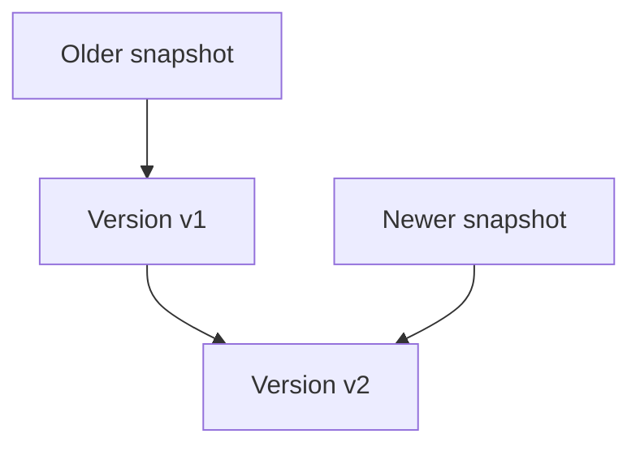

# 13 — Concurrency Control, Isolation, and MVCC

> Goal: connect locks, isolation levels, deadlocks, and MVCC to the anomalies they prevent or permit.

## 1. Why concurrency control exists

Concurrency control aims to preserve a defined correctness guarantee while allowing transactions to overlap. The main families are:

- lock-based protocols;
- timestamp ordering;
- optimistic concurrency control (OCC);
- multiversion concurrency control (MVCC);

Real systems often combine them—for example, MVCC for reads plus locks for writes and schema changes.

## 2. Shared and exclusive locks

- **Shared (`S`) lock:** used for reading; multiple transactions may hold compatible shared locks.
- **Exclusive (`X`) lock:** used for writing; conflicts with both shared and exclusive locks held by others.

| Requested / held | S | X |
|---|---:|---:|
| S | Compatible | Conflict |
| X | Conflict | Conflict |

Lock granularity may be database, table, page, row, key, or key range. Fine granularity improves concurrency but creates more lock-management overhead.

## 3. Intention locks and escalation

Intention locks communicate plans to lock lower-level objects:

- `IS`: intends shared locks below;
- `IX`: intends exclusive locks below;
- `SIX`: shared at this level plus intends exclusive locks below.

They let the DBMS check table-level compatibility without examining every row lock. **Lock escalation** replaces many fine locks with a coarser one, reducing overhead but potentially reducing concurrency.

## 4. Two-phase locking (2PL)

Basic 2PL has:

1. **Growing phase:** acquire locks, release none.
2. **Shrinking phase:** release locks, acquire no new ones.

It guarantees conflict serializability, but can deadlock.

- **Conservative/static 2PL:** obtain all locks before execution; avoids deadlock but needs advance knowledge and reduces concurrency.
- **Strict 2PL:** hold exclusive/write locks until commit/abort; produces strict schedules and simplifies recovery.
- **Rigorous 2PL:** hold all shared and exclusive locks until commit/abort.

Terminology can vary slightly across textbooks; state your definition.

## 5. Deadlocks

A deadlock occurs when transactions wait in a cycle.


### Handling strategies

- **Detection:** build/approximate a wait-for graph; abort a victim when a cycle is found.
- **Timeout:** abort after excessive waiting; simple but can produce false positives and slow detection.
- **Prevention:** impose ordering or timestamp rules.
  - **Wait-die:** older waits; younger aborts when requesting from older (non-preemptive).
  - **Wound-wait:** older aborts a younger holder; younger waits for older (preemptive).
- **Avoidance:** grant requests only if safe; uncommon when future DB lock needs are unknown.

Minimize deadlocks by accessing resources in a consistent order, keeping transactions short, and indexing so updates find rows efficiently. Still implement retry.

## 6. Timestamp ordering

Each transaction receives a timestamp. Operations are accepted or aborted according to read/write timestamps so the result follows timestamp order. It avoids waiting-based deadlock but may cause repeated aborts/starvation under contention. Thomas’s write rule can ignore certain obsolete writes in variants.

## 7. Optimistic concurrency control

OCC assumes conflicts are uncommon:

1. **Read/work phase:** operate on a private workspace or versions.
2. **Validation phase:** verify no invalidating conflict.
3. **Write phase:** install changes if validation succeeds.

It performs well with low contention and short transactions; high contention wastes work through aborts.

## 8. Isolation levels

The SQL standard describes phenomena, but actual guarantees differ across DBMSs.

| Level | Typical intent | Important caution |
|---|---|---|
| Read uncommitted | Weakest; dirty reads may occur | Some MVCC DBs effectively provide stronger behavior |
| Read committed | Each statement sees committed data | Two statements can see different snapshots |
| Repeatable read | Stable repeated reads within a transaction | Phantom/write-skew behavior is DB-specific |
| Serializable | Outcome consistent with some serial order | May block or abort; application must retry |

Never answer isolation questions solely from this generic table when a specific DBMS is named.

## 9. MVCC mental model

MVCC retains multiple logical versions of rows. A transaction reads versions visible to its snapshot rather than necessarily waiting for an active writer.



Each version has metadata that lets the DB decide whether it was created/deleted before, during, or after the reader’s snapshot. Implementation differs: versions may live in table pages, undo segments, or separate storage.

### What MVCC gives

- readers often do not block writers;
- writers often do not block ordinary snapshot readers;
- consistent point-in-time reads;
- old versions that must eventually be reclaimed.

### What MVCC does not give automatically

- writers can still conflict with writers;
- locks still exist;
- all isolation levels are not automatically serializable;
- long-lived snapshots are not free;
- write skew may occur under snapshot isolation.

## 10. Snapshot isolation vs serializability

Snapshot isolation commonly provides a stable snapshot and rejects concurrent writes to the same row/item. It prevents many anomalies, including common lost-update patterns, but transactions updating disjoint rows can still produce write skew.

Serializable MVCC implementations add mechanisms such as dependency tracking, predicate/range locking, or validation. They may abort a transaction with a serialization failure; retry is part of normal operation.

## 11. `SELECT ... FOR UPDATE`

Use locking reads when a business decision depends on a row that will be updated and concurrent change must be prevented. But:

- locking only returned rows may not protect an abstract predicate;
- lock strength and range behavior vary;
- excessive locking reduces concurrency;
- consistent lock order remains important.

Prefer a single atomic conditional statement when possible:

```sql
UPDATE inventory
SET quantity = quantity - 1
WHERE sku = ? AND quantity > 0;
```

Success is determined by affected-row count.

## 12. Version cleanup and long transactions

Old versions cannot be reclaimed while they may still be visible to a snapshot. Long transactions can therefore cause table/undo growth, cleanup lag, cache pressure, and replication problems. PostgreSQL calls its cleanup mechanism vacuum; other engines use different machinery.

## 13. Common traps

- Deadlock and starvation are different: deadlock is cyclic waiting; starvation is indefinite postponement.
- 2PL provides conflict serializability; strict 2PL additionally simplifies recovery.
- MVCC means “multiple versions,” not “no locks.”
- Read committed often gives a new snapshot per statement, not per transaction.
- Repeatable read and snapshot isolation are not universal synonyms.
- Serializable does not mean transactions never overlap.
- Retrying only the failed SQL statement may be wrong; retry the transaction’s full decision logic.
- A lock prevents conflicting access only within its exact scope.

## Interview checks

1. How can 2PL be serializable and still deadlock?
2. Compare wait-die and wound-wait for an older requester.
3. Why do long-running reads hurt an MVCC database?
4. How can snapshot isolation permit write skew?
5. When would you use optimistic locking versus `FOR UPDATE`?
6. Why must a serializable transaction sometimes abort?

## 60-second recall

- `S` shares with `S`; `X` conflicts with both.
- 2PL: grow then shrink; strict 2PL holds write locks through completion.
- Deadlock: wait cycle; prevent, detect, timeout, abort/retry.
- MVCC: snapshot-visible versions; readers and writers interfere less.
- MVCC still has locks, cleanup, write conflicts, and possible write skew.
- Isolation names are DB-specific contracts—verify behavior.

## Sources for deeper revision

- [PostgreSQL: Concurrency Control](https://www.postgresql.org/docs/current/mvcc.html)
- [PostgreSQL: Explicit Locking and Deadlocks](https://www.postgresql.org/docs/current/explicit-locking.html)
- [PostgreSQL: Transaction Isolation](https://www.postgresql.org/docs/current/transaction-iso.html)

