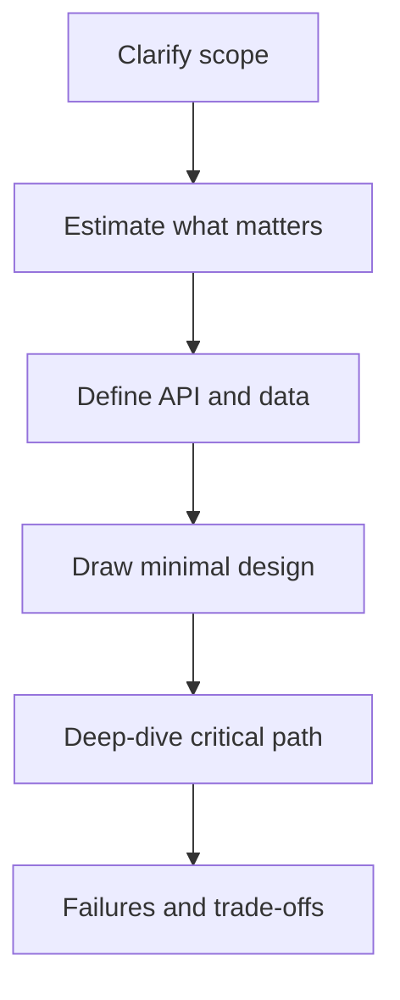

# 01 — System Design Fundamentals and Interview Framework

> Goal: drive a 40–45 minute HLD interview with clear assumptions, an incremental design, and explicit trade-offs.

## 1. What HLD evaluates

High-level design is not a test of how many technologies you can name. It evaluates whether you can:

- turn an ambiguous problem into concrete requirements;
- divide a system into sensible components;
- choose data and communication models from access patterns;
- reason about scale, correctness, failures, security, and operations;
- identify trade-offs and evolve a simple design;
- communicate and respond to changed constraints.

A good answer is not one universal architecture. It is a defensible architecture for stated requirements.

## 2. Start with requirements

### Functional requirements

What users and other systems must be able to do. For a chat system:

- send and receive one-to-one messages;
- view recent conversation history;
- see delivery/read status;
- receive offline notifications.

Prioritize 2–4 core flows. Explicitly defer secondary features.

### Non-functional requirements

Ask only what can change the design:

- expected users, traffic, object count, and growth;
- read/write ratio and peak-to-average load;
- latency target and throughput;
- availability and durability expectations;
- consistency requirements per operation;
- geographic distribution;
- privacy, abuse, retention, and cost constraints.

**Trap:** “Highly scalable and available” is not a requirement until you attach a workload and acceptable behavior.

## 3. A reliable interview sequence

Suggested time budget:

| Phase | Minutes | Output |
|---|---:|---|
| Requirements | 4–6 | Prioritized use cases and guarantees |
| Estimates | 3–5 | Scale class and dominant constraints |
| API/data model | 5–7 | Contracts and access patterns |
| High-level design | 8–10 | End-to-end read/write flows |
| Deep dive | 12–15 | Bottleneck, correctness, scaling, failures |
| Summary | 2–3 | Decisions, trade-offs, next limit |

Adapt to the interviewer. Do not spend ten minutes calculating when scale will not affect the design.

## 4. Establish the system boundary

State:

- actors and external systems;
- what this service owns;
- what is synchronous versus asynchronous;
- what is outside scope;
- source of truth for each important fact.

Example: “The order service owns order state; the payment provider owns card authorization. We persist an order before asynchronous fulfillment.”

## 5. API and data before boxes

APIs reveal operations; data models reveal access patterns and invariants.

For each core API, note:

- input/output and authentication;
- idempotency requirement;
- pagination/order;
- expected frequency and payload size;
- error and retry behavior.

For each entity, note:

- identity and important fields;
- primary read/write queries;
- uniqueness and lifecycle;
- consistency and retention.

This prevents “load balancer → services → database” diagrams with no connection to actual behavior.

## 6. Build the simplest correct design first

Start with one deployable service and one suitable store if that meets the initial requirements. Then introduce components only for a demonstrated reason:

- multiple instances for throughput/availability;
- cache for repeated expensive reads;
- queue for asynchronous buffering/decoupling;
- replicas for read scale or failover;
- sharding when one database cannot meet write/storage needs;
- CDN for globally distributed static/large content.

Every added box creates operational and failure complexity. Explain its purpose.

## 7. Narrate critical flows

Walk through at least one write and one read:

1. client request and routing;
2. validation/authentication;
3. source-of-truth update;
4. cache/event/secondary-index effects;
5. response timing;
6. behavior on timeout, duplicate, or dependency failure.

Arrows without a sequence are not enough. State what happens before acknowledgement.

## 8. Deep-dive dimensions

Use the interviewer’s signals, then cover the riskiest two or three:

- data partitioning and hotspots;
- consistency and concurrency;
- cache correctness;
- message delivery and ordering;
- overload and backpressure;
- multi-region behavior;
- security/abuse;
- observability and recovery.

## 9. Trade-off language

Prefer:

> “Because the feed is read-heavy and slightly stale results are acceptable, I would cache the first page for a short TTL. This lowers database reads but creates invalidation and hot-key risk.”

Avoid:

> “Use Redis because Redis is fast.”

Strong answers connect **requirement → decision → cost → mitigation**.

## 10. Common traps

- Solving an unstated version of the problem.
- Naming cloud products instead of explaining capabilities.
- Assuming “NoSQL” means unlimited scale.
- Adding microservices before defining ownership boundaries.
- Claiming exact-once delivery without defining scope.
- Discussing only the happy path.
- Treating every operation as needing the same consistency.
- Ignoring deletion, privacy, abuse, migration, and observability.
- Over-designing for billions of users when the prompt says internal tool.

## Interview checks

1. Which five questions would you ask before designing a URL shortener?
2. When should you skip capacity estimation?
3. How do you show that a queue is necessary rather than decorative?
4. What makes one component the source of truth?
5. How would you recover after realizing your first assumption was wrong?

## 60-second recall

- Clarify → estimate → API/data → minimal design → deep dive → failures/trade-offs.
- Scope core features and name exclusions.
- Scale and guarantees must be concrete enough to affect decisions.
- Narrate read/write paths and acknowledgement boundaries.
- Every component needs a reason and creates a cost.
- Requirement → choice → trade-off → mitigation.

## Sources for deeper revision

- [Amazon system-design interview objectives](https://www.amazon.jobs/content/en/how-we-hire/sdm-interview-prep)
- [Microsoft technical interviewing guidance](https://careers.microsoft.com/v2/global/en/hiring-tips/technical-interviewing.html)
- [Azure Architecture Center: Design Principles](https://learn.microsoft.com/en-us/azure/architecture/guide/design-principles/)

