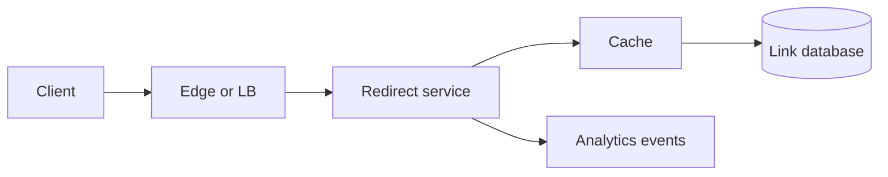
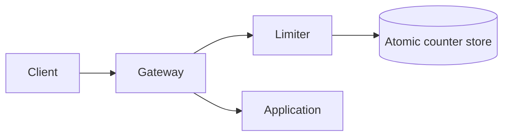
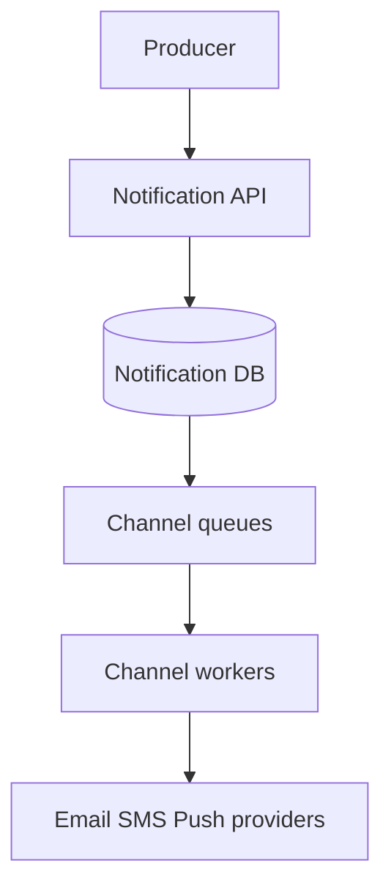

# 15 — Foundational System Design Case Studies

> Practise each in 25–35 minutes. State requirements first, build a minimal correct version, then scale the critical path.

## Case 1: URL Shortener

### Scope

- Create short URL for a long URL.
- Redirect with very low latency.
- Optional custom alias, expiry, and basic analytics.

### APIs and data

```http
POST /v1/links { long_url, custom_alias?, expires_at? }
GET  /{code} → 301/302 redirect
```

```text
Link(code PK, long_url, owner_id, created_at, expires_at, status)
```

### Design



- Generate code using encoded allocated ID, random token with collision check, or pre-generated keys.
- Cache popular `code → URL` mappings and negative results briefly.
- Keep analytics asynchronous so redirect does not wait.
- Use object/key-based partitioning by code if needed.

### Decisions and traps

- `301` may be cached aggressively and makes destination updates harder; `302/307` gives more control/analytics.
- Sequential IDs are simple but guessable and reveal volume; encrypt/permutate or use random tokens if needed.
- Validate schemes and block unsafe destinations according to product risk.
- Custom aliases need atomic uniqueness.
- Deletion/expiry must propagate to cache/CDN.

### Follow-ups

- Prevent enumeration and malicious links.
- Choose code length/collision strategy.
- Handle a celebrity hot link.
- Multi-region creation without collisions.
- Exactly accurate analytics versus sampled events.

---

## Case 2: Distributed Rate Limiter

### Scope

- Enforce limits per user/API/tenant.
- Return allow/deny plus remaining quota/reset hints.
- Decide whether limits are global, regional, strict, or approximate.

### Algorithms

| Algorithm | Good property | Weakness |
|---|---|---|
| Fixed window | Simple, low storage | Boundary burst |
| Sliding log | Precise | Stores every timestamp |
| Sliding counter | Efficient approximation | Approximation |
| Token bucket | Allows configured burst | State/refill calculation |
| Leaky bucket | Smooth output | Can delay/drop bursts |

### Design



- Create key from subject + route + policy dimension.
- Execute read/check/update/expiry atomically using store primitive or script.
- Cache policies locally with version/TTL.
- Shard counters by key; replicate according to required availability.
- Emit metrics asynchronously.

### Decisions and traps

- Global exact rate needs cross-region coordination; regional allowance with allocated quotas is lower latency.
- IP-only limiting harms users behind NAT and is easy to rotate.
- Fail-open preserves availability; fail-closed preserves protection. Decide per endpoint.
- Include request cost for expensive endpoints, not only count.
- Clock/window and retry behavior must be defined.

### Follow-ups

- One customer with many API keys.
- Hot global key.
- Dynamic plan upgrades.
- Prevent double allowance across regions.
- Limit WebSocket messages/connections.

---

## Case 3: Notification Service

### Scope

- Receive a notification request/event.
- Deliver through email, SMS, push, or in-app.
- Respect preference, priority, template, rate, retry, and provider failure.

### Data

```text
Notification(id, user_id, type, channel, status, scheduled_at,
             idempotency_key, attempts, provider_message_id)
Preference(user_id, event_type, allowed_channels, quiet_hours)
Template(id, version, channel, locale, content)
```

### Design



- Atomically persist request and enqueue through outbox/CDC.
- Resolve preference/template and route to channel queue.
- Provider adapters use stable idempotency/correlation ID.
- Retry transient errors with backoff; permanent errors go to failed/DLQ state.
- Webhooks update delivery status idempotently.

### Decisions and traps

- “Sent” may mean accepted by provider, not delivered/read.
- Preserve ordering only where required; OTP should not arrive after a newer OTP.
- Separate critical transactional notifications from marketing traffic.
- Quiet hours and locale require time-zone/version considerations.
- Do not log secrets or full sensitive message bodies.

### Follow-ups

- Provider failover without duplicates.
- Schedule millions at 9 AM local time.
- Preference changes after enqueue.
- OTP latency and expiry.
- Deduplicate producer retries.

---

## Case 4: Distributed Job Queue / Scheduler

### Scope

- Submit immediate or delayed jobs.
- Workers claim, execute, retry, and expose status.
- Support priority, recurring jobs, and recovery from worker crash.

### Data and API

```http
POST /v1/jobs { type, payload_ref, run_at, priority, idempotency_key }
GET  /v1/jobs/{id}
POST /v1/jobs/{id}:cancel
```

```text
Job(id, type, status, run_at, priority, attempt,
    lease_owner, lease_until, payload_ref, last_error)
```

### Design

- API stores job and returns stable ID.
- Scheduler places due jobs into partitioned work queues.
- Worker claims with visibility timeout/lease.
- Worker updates durable outcome and acknowledges.
- Watchdog recovers expired claims.
- DLQ stores exhausted/permanent failures.

### Decisions and traps

- Worker may complete effect then crash before ack; handlers must be idempotent.
- Lease expiry requires heartbeat/extension and stale-owner handling.
- Queue depth should be paired with oldest-job age.
- Global priority is expensive; priority queues may starve lower classes.
- Recurring schedule needs timezone/DST/missed-run semantics.
- Large payloads belong in object storage/database; queue carries reference.

### Follow-ups

- Prevent two workers processing one job.
- Cancel an already running job.
- Ensure per-customer fairness.
- Retry after partial external effect.
- Schedule billions of timers efficiently (bucket/timing-wheel intuition).

---

## Case 5: Pastebin / Text Sharing

### Scope

- Create text paste and return shareable ID.
- Read by ID; optional expiry, visibility, syntax metadata, and deletion.

### Data and design

```text
Paste(id, owner_id?, object_key/content, created_at, expires_at,
      visibility, content_hash, status)
```

- Store small text directly in a database or large bodies in object storage.
- Metadata/ownership in relational or key-value store.
- Cache popular public pastes; CDN if content is immutable/cacheable.
- Generate unpredictable IDs for unlisted content; unpredictability is not authorization.
- Expiry worker marks/deletes metadata and objects idempotently.

### Decisions and traps

- Public content needs abuse reporting, malware/secret scanning, and rate limits.
- Private paste needs actual authentication/authorization.
- Encryption and deletion rules must include cache/CDN/backups.
- Deduplication by content hash can leak whether content exists and complicate ownership/deletion.
- TTL cleanup may be asynchronous; reads must enforce expiry immediately.

### Follow-ups

- Edit/version pastes.
- Prevent hot content overloading storage.
- Search public pastes.
- Burn-after-read concurrency.
- Regional storage and legal deletion.

## Cross-case comparison

| System | Dominant challenge | Useful building block |
|---|---|---|
| URL shortener | Read latency and key generation | Cache + durable mapping |
| Rate limiter | Atomic distributed decision | Token bucket + counter store |
| Notification | At-least-once external effects | Queue + idempotency + provider adapter |
| Job scheduler | Lease/retry/delayed work | Durable jobs + queue + watchdog |
| Pastebin | Blob lifecycle and abuse | Object store/CDN + metadata DB |

## Practice rule

After each design, answer:

1. What is the source of truth?
2. What is acknowledged synchronously?
3. Where can duplicates occur?
4. What is the partition/hot key?
5. What fails when cache, queue, database, or worker is unavailable?
6. Which requirement would force the next architectural change?

