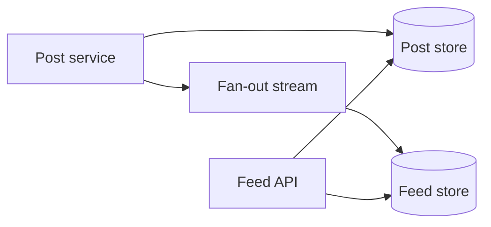
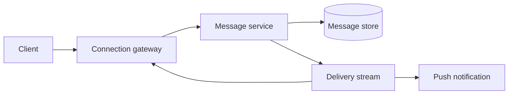
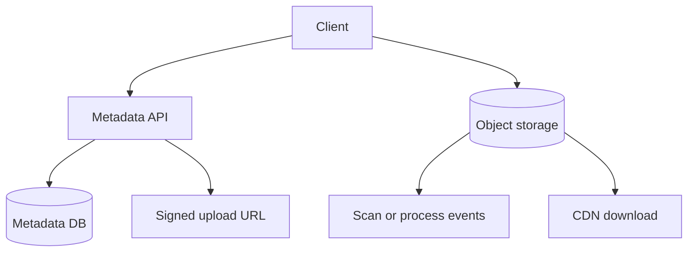

# 16 — Product System Design Case Studies

> Focus on product behavior, skew, real-time delivery, derived data, and privacy. Do not memorize one company’s architecture.

## Case 1: News Feed

### Core requirements

- Publish a post.
- Follow users.
- Retrieve a ranked or chronological home feed.
- Support deletion/privacy changes.

### Main design choice: fan-out

- **Fan-out on write:** publish post IDs into follower feed inboxes. Fast reads; expensive celebrity writes and duplicated references.
- **Fan-out on read:** fetch posts from followed users at read time. Cheap writes; expensive/variable reads.
- **Hybrid:** precompute ordinary users; fetch celebrity/high-fan-out accounts at read time and merge.



### Data and scaling

- Post store keyed by author/post ID.
- Follow graph optimized for follower/following queries.
- Feed inbox contains post references + ranking metadata, not duplicated full posts.
- Cache first feed page; cursor pagination by stable score/time + ID.
- Ranking service can degrade to chronological.

### Traps/follow-ups

- Celebrity post causes write explosion.
- Privacy/unfollow/delete must remove or filter stale feed entries.
- Pagination under changing ranking needs cursor/snapshot semantics.
- Exactly accurate like counts are unnecessary on read path; user’s own like needs read-your-writes.
- Ask: pull vs push, freshness, ranking latency, blocked users, ads.

---

## Case 2: Chat and Messaging

### Core requirements

- One-to-one/group messages.
- Online delivery and offline history.
- Per-conversation order, delivery/read receipts, multi-device sync.

### Design



### Key decisions

- Authenticate persistent socket; gateway registry maps user/device to connection shard.
- Message service assigns stable message ID and conversation sequence/order.
- Persist before acknowledging “sent” according to durability requirement.
- Partition messages by conversation ID; order only within conversation.
- Deliver at least once and deduplicate using message ID.
- Offline clients fetch after last acknowledged sequence/cursor.

### State meanings

- `sent`: accepted/durably stored by service;
- `delivered`: reached at least one/all intended devices—define it;
- `read`: recipient client reported reading.

### Traps/follow-ups

- WebSocket is not message persistence.
- Group with millions of members creates fan-out/hot partition.
- Reconnect may duplicate or miss without sequence/cursor.
- Multi-device read state requires monotonic version.
- E2E encryption changes server search/moderation/multi-device key management.
- Ask: ordering across regions, presence freshness, attachments, message deletion.

---

## Case 3: Search Autocomplete

### Core requirements

- Given prefix and context, return top suggestions within low latency.
- Incorporate popularity and possibly locale/personalization.
- Update suggestions on a bounded freshness schedule.

### Design

- Normalize query carefully by language/locale.
- Offline/stream pipeline aggregates query counts and filters abuse/private data.
- Build trie/FST-like prefix index or precomputed `prefix → top K` store.
- Replicate immutable index snapshots to memory-serving nodes.
- Cache hot prefixes at edge/service.
- Use versioned rollout and fallback to older snapshot.

### Trade-offs

- Precompute every prefix: fast reads, more build/storage.
- Traverse a trie then rank: flexible, more online work.
- Personalization: better relevance, higher latency/privacy/cache-key complexity.
- Typo tolerance: edit-distance/fuzzy index cost.

### Traps/follow-ups

- Do not issue expensive SQL `LIKE '%...%'` at high scale.
- Empty/one-letter prefixes are extremely hot.
- Trending data can be manipulated; use thresholds/abuse controls.
- Never leak private or rare queries.
- Ask: freshness, multilingual text, ranking, deletion, top-K merging.

---

## Case 4: Cloud File Storage

### Core requirements

- Upload/download files.
- Folders/metadata and sharing.
- Resume, synchronization, versioning, deletion.

### Design



### Upload flow

1. Authenticate and create upload session/metadata in `UPLOADING` state.
2. Client uploads chunks directly using signed URLs.
3. Verify checksums and complete multipart object.
4. Scan/process, then mark version `AVAILABLE`.
5. Notify/synchronize devices.

### Data model

- File/folder identity and ownership.
- Version → immutable object key, size, checksum.
- Sharing/ACL records.
- Upload session/chunk state.
- Change sequence per user/drive for sync.

### Traps/follow-ups

- Object storage success and metadata update form a workflow; clean orphan objects/sessions.
- Rename folder should update metadata, not move all blob bytes.
- Content hash dedup has privacy/ownership risks.
- Signed URL needs short expiry, exact method/key/size constraints.
- Ask: concurrent edits, delta sync, virus scan, quota, deletion/backups, CDN authorization.

---

## Case 5: Photo-Sharing Service

### Core requirements

- Upload photos, generate variants, view profile/feed, like/comment, privacy controls.

### Design

- Client uploads original to object storage with upload session.
- Event triggers validation, metadata extraction, moderation, thumbnails/resizing.
- Metadata database owns photo state and object keys.
- CDN serves approved variants through public or signed paths.
- Feed uses patterns from Case 1.
- Counts can be sharded/aggregated asynchronously; user action remains idempotent.

### State machine

```text
UPLOADING → PROCESSING → AVAILABLE
                 └────→ REJECTED/FAILED
AVAILABLE → DELETING → DELETED
```

Clients must not receive paths to unverified content as if it were available.

### Traps/follow-ups

- Store original plus versions; make processing idempotent.
- Avoid predictable private object URLs.
- Deletion includes metadata, CDN, derived variants, search/feed, and retention policy.
- Image-processing spike needs queue/backpressure.
- Ask: duplicate upload, filters/edit history, content moderation, popular photo, location privacy.

## Cross-case patterns

| Pattern | Feed | Chat | Autocomplete | File/photo |
|---|---|---|---|---|
| Primary partition key | User/feed owner | Conversation | Prefix/index shard | Owner/file ID |
| Derived data | Feed inbox/ranking | Delivery/read state | Prefix top-K index | Thumbnails/CDN |
| Main skew | Celebrity | Huge group | Short prefix | Viral file/photo |
| Correctness focus | Privacy/deletion | Ordering/dedup | Privacy/freshness | Ownership/version workflow |
| Degradation | Chronological | Offline sync | Older index | Original/download delay |

## Practice prompts

For each system, be ready to change one assumption:

- Make it multi-region.
- Require immediate deletion.
- Add one celebrity/large tenant.
- Remove the cache or queue.
- Require offline clients.
- Tighten consistency for one operation.
- Double writes but not reads.

Explain which component or data model changes—and which remain unchanged.

