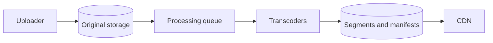
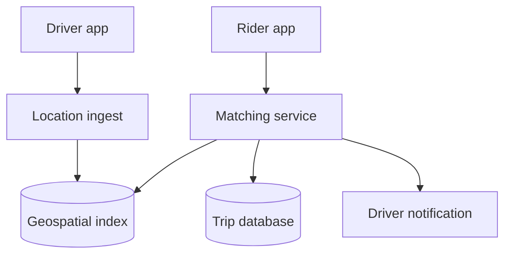
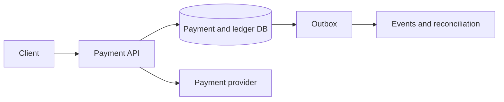
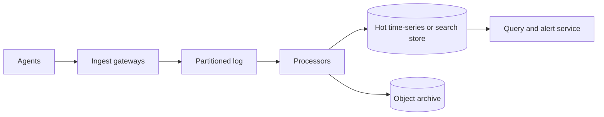

# 17 — Advanced System Design Case Studies

> These combine multiple patterns. For fresher interviews, a clear core flow and correct trade-offs matter more than reproducing production-scale internals.

## Case 1: Video Streaming Platform

### Requirements

- Upload video.
- Process multiple formats/bitrates.
- Stream globally with adaptive quality.
- Store metadata, views, and optional recommendations/comments.

### Upload and processing



- Multipart/direct upload with checksum.
- Metadata state: `UPLOADING → PROCESSING → READY/FAILED`.
- Idempotent jobs create codec/resolution variants and segmented manifests.
- CDN serves segments; adaptive player selects bitrate using bandwidth/buffer.
- Origin shield and multi-tier caching protect storage.

### Scale and traps

- Egress dominates; estimate bytes and cache hit rate, not only API QPS.
- Popular and long-tail videos need different cache behavior.
- View counts can be buffered/aggregated with fraud filtering; exact synchronous count is unnecessary.
- DRM/signed URLs, takedown, region restriction, captions, and moderation matter.
- Upload success does not mean video is streamable.

### Follow-ups

- Live streaming changes ingestion, latency, fan-out, and DVR.
- Resume playback stores small per-user position state.
- Fast global takedown needs metadata authorization plus CDN purge/short tokens.

---

## Case 2: Ride-Hailing / Nearby Drivers

### Requirements

- Drivers continuously update location/availability.
- Rider requests nearby candidates.
- Match one driver, track trip, calculate ETA, and prevent double assignment.

### Design



- Location is high-write, ephemeral, and can tolerate bounded staleness.
- Partition geographic index into cells/geohashes; query current and neighboring cells.
- Matching service selects candidates, scores ETA, and sends offers.
- Trip assignment uses conditional state transition/lease so one driver gets at most one active trip.
- Durable trip state is separate from ephemeral latest location.

### Traps

- Geographic boundaries require adjacent-cell search.
- Dense cities create hot cells; dynamically refine/split or partition by cell + bucket.
- GPS is noisy/out-of-order; attach device sequence/time and reject stale updates.
- Two matchers can offer same driver; atomic assignment needed.
- A driver notification timeout is an unknown outcome, not rejection.

### Follow-ups

- Surge pricing pipeline.
- Driver/rider location privacy and retention.
- Multi-region city partitioning.
- Reassignment after driver disconnects.

---

## Case 3: Ticket Booking

### Requirements

- Search event and seat availability.
- Temporarily hold seats.
- Pay and confirm without overselling.
- Release expired/failed reservations.

### Data and state

```text
Seat(event_id, seat_id, status, reservation_id, version)
Reservation(id, user_id, expires_at, status, amount)
Payment(id, reservation_id, provider_ref, status, idempotency_key)
```

States:

```text
AVAILABLE → HELD → CONFIRMED
              └→ RELEASED/EXPIRED
```

### Flow

1. Search serves cached/derived availability; final booking never trusts cache alone.
2. Atomically change selected seats from `AVAILABLE` to `HELD`, create reservation with expiry.
3. Initiate idempotent payment.
4. Confirm reservation transactionally after verified payment outcome.
5. Expiry worker releases unconfirmed holds idempotently.
6. Reconcile payment, reservation, and provider records.

### Traps

- Distributed lock alone is weaker than authoritative conditional update/constraint.
- Clock and late payment after hold expiry need explicit rule/refund path.
- Popular events create a hot partition and bot surge; use virtual waiting room, admission control, per-user limit.
- Cached seat map can be stale; label it and revalidate.
- Payment timeout may have succeeded externally.

### Follow-ups

- General admission inventory via atomic counter/reservation.
- Fair waiting room and signed admission token.
- Multi-seat atomicity and partial availability.

---

## Case 4: Payment System and Ledger

### Requirements

- Initiate payment against provider.
- Track authorization/capture/refund.
- Prevent duplicate charge.
- Maintain auditable balances and reconcile.

### Design



- Client supplies scoped idempotency key; database uniqueness returns same payment/result.
- Payment is a state machine, not one boolean.
- Use immutable double-entry ledger for financial movement; derive balances.
- Provider request carries stable merchant reference/idempotency key.
- Webhooks and polling/status query update internal state idempotently.
- Outbox publishes internal events after local commit.
- Reconciliation compares settlements/provider reports to internal records.

### Traps

- Never hold a DB transaction open across a slow provider call.
- Timeout outcome is unknown; query before charging again.
- Refund does not erase original charge; it is another ledger movement.
- Do not use floating-point amounts.
- Encrypt/tokenize payment data and minimize compliance scope.
- “Exactly once” should mean one business charge per idempotency scope, not one HTTP execution.

### Follow-ups

- Partial capture/refund.
- Currency/rounding.
- Provider failover without double charge.
- Available vs pending balance.
- Chargebacks and audit history.

---

## Case 5: Metrics and Log Ingestion Platform

### Requirements

- Ingest high-volume telemetry.
- Query recent data and dashboards.
- Retain/aggregate by policy.
- Alert on conditions without telemetry system causing application failure.

### Design



- Batch/compress client sends; bounded local buffer and sampling under pressure.
- Ingest authenticates tenant and partitions by tenant/metric/time with hotspot strategy.
- Stream processors parse, enrich, aggregate, and route malformed events.
- Hot store serves bounded recent queries; object storage retains cheap immutable archive.
- Downsample old metrics and apply retention.
- Query service enforces time/range/cardinality limits.

### Traps

- User/request IDs as metric labels cause cardinality explosion.
- Telemetry must not block the production request path.
- One large tenant needs quotas and isolation.
- Timestamps may arrive late/out of order; choose event-time windows and lateness policy.
- The monitoring system needs independent health monitoring and simple fallback.

### Follow-ups

- Deduplication after agent retry.
- Regional ingestion during partition.
- Alert evaluation frequency/state.
- Full-text log search versus metric aggregation.

## Advanced comparison

| System | Source of truth | High-volume path | Correctness boundary | Main hotspot |
|---|---|---|---|---|
| Video | Metadata + object storage | CDN segment delivery | Upload/version state | Viral title/origin miss |
| Ride-hailing | Trip DB | Location ingestion | Driver/trip assignment | Dense geographic cell |
| Tickets | Seat/reservation DB | Availability browsing | Seat hold/confirmation | Popular event |
| Payments | Payment + ledger DB | Provider/events | Idempotent charge/ledger | Merchant/provider dependency |
| Telemetry | Durable log/archive | Event ingestion | Accepted/durable ingest contract | Tenant/label cardinality |

## Interview closing checklist

For any advanced system, close with:

1. Core state machine and source of truth.
2. Partition key and pathological hot key.
3. Acknowledgement/durability boundary.
4. Duplicate, timeout, and retry handling.
5. Degraded mode during dependency failure.
6. SLO and two alerts.
7. Security/privacy/abuse risk.
8. Migration/reconciliation or restore plan.

