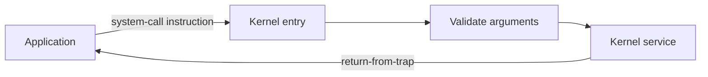

# 01. OS Fundamentals and Architecture

> High-yield revision sheet for SDE placements. Focus on the mechanism, the reason it exists, and common interview traps.

## Mental model

An operating system sits between applications and hardware. It provides:

1. **Abstractions:** process instead of raw CPU state, virtual memory instead of raw RAM, file instead of disk sectors.
2. **Resource management:** decides who receives CPU time, memory, storage and device access.
3. **Isolation and protection:** prevents one program from corrupting another program or the kernel.
4. **Common services:** system calls, networking, files, timers and device access.

The three recurring OS ideas are **virtualization, concurrency and persistence**.

## Kernel and user space

| User space | Kernel space |
|---|---|
| Applications and most libraries | Scheduler, virtual memory, filesystems, drivers |
| Restricted privilege | Full hardware privilege |
| Cannot directly execute privileged instructions | Can configure page tables, interrupts and devices |
| Failure usually kills one process | Failure can crash or compromise the system |

The CPU, not a programming-language rule, enforces privilege. A **mode bit / privilege level** records whether privileged operations are permitted.

## Entering the kernel

| Event | Cause | Synchronous? | Example |
|---|---|---:|---|
| System call | Intentional request by a program | Yes | `read`, `write`, `fork` |
| Exception/fault | Current instruction encounters a condition | Yes | page fault, divide by zero |
| Hardware interrupt | External device or timer | No | keyboard, disk completion, timer |

During kernel entry, hardware switches privilege, saves enough execution state, and transfers control to a predefined handler. The kernel must validate every user pointer and argument because user programs are untrusted.

### Trap, fault and abort

Terminology varies by architecture and textbook, but the useful distinction is:

- **Trap:** intentional or reported after the instruction; often used for system calls/debugging.
- **Fault:** potentially recoverable and may restart the instruction, such as a page fault.
- **Abort:** severe condition that is generally not restartable.

## Mode switch vs context switch

- **Mode switch:** same process moves between user and kernel execution.
- **Context switch:** CPU changes the currently running thread/process.
- A system call causes a mode switch, but it does **not necessarily** cause a context switch.
- A timer interrupt can lead the scheduler to context-switch to another thread.

## Why timer interrupts matter

Without a programmable timer, a CPU-bound or malicious program could keep the CPU forever. The kernel programs the timer before returning to user mode; the interrupt restores kernel control and enables preemption.

## OS services and system calls

Major system-call categories:

- Process control: create, terminate, wait and signal.
- File management: open, close, read, write, seek and metadata.
- Device management: request/release devices and device-specific control.
- Memory management: map, unmap, protect and share memory.
- Information: time, identifiers, limits and system information.
- Communication: pipes, sockets, shared memory and messages.
- Protection: permissions, identities and access control.

A library function may execute entirely in user space or wrap one/more system calls. Therefore **function call != system call**.

## OS structures

| Structure | Core idea | Strength | Cost/concern |
|---|---|---|---|
| Monolithic kernel | Most services run in one kernel address space | Fast direct calls | Large trusted code base |
| Layered | Each layer uses lower layers | Clear separation | Strict layering can be inflexible |
| Microkernel | Minimal kernel; services in user processes | Isolation and extensibility | IPC/context-switch overhead |
| Modular monolithic | Loadable kernel modules | Performance plus extensibility | Faulty module still has kernel privilege |
| Hybrid | Mix of monolithic and microkernel ideas | Practical engineering trade-offs | Boundaries may be complex |

**Mechanism vs policy:** mechanism supplies capability; policy chooses how to use it. A timer is a mechanism; a scheduling algorithm is policy.

## Boot sequence

1. Firmware performs initialization and selects a boot device.
2. Bootloader loads the kernel and initial data into memory.
3. Kernel initializes CPU state, memory management, interrupts and drivers.
4. Kernel mounts the root filesystem.
5. Kernel starts the first user-space process/service manager.
6. Services and login/session components start.

## OS categories

- **Batch:** jobs processed with little interaction.
- **Multiprogramming:** several jobs kept ready so CPU can run while another waits for I/O.
- **Time-sharing/multitasking:** short preemptive slices provide interactive response.
- **Multiprocessing:** multiple CPUs/cores execute work.
- **Real-time:** correctness includes timing constraints; hard real-time cannot miss critical deadlines.
- **Embedded:** optimized for a constrained device and workload.
- **Distributed OS:** attempts to manage several machines as a coordinated system; separate from ordinary networked applications.

## Common traps

- Kernel and operating system are related but not always identical terms.
- Shell/terminal is a user-space program, not the kernel.
- A page fault is an exception; it is not necessarily an application error.
- An interrupt does not automatically imply a process switch.
- Microkernels improve fault isolation, but moving services to user space can add communication overhead.
- Dual mode protects the kernel only if hardware and page permissions are configured correctly.

## Interview checks

1. Why can an application not directly modify its page table?
2. Explain the complete path of a `read()` system call.
3. Can a mode switch occur without a context switch? Give an example.
4. What brings control back to the OS from an infinite user loop?
5. Compare monolithic and microkernel designs.
6. Why must the kernel copy/validate user arguments?
7. Is every library call a system call?

## 60-second recall

- OS = abstraction + resource management + isolation.
- Kernel runs privileged; applications normally do not.
- System calls and faults are synchronous; hardware interrupts are asynchronous.
- Mode switch changes privilege; context switch changes the running execution context.
- Timer interrupts enable preemption.
- Architecture choices trade performance, isolation and maintainability.

## References

- [OSTEP: Introduction and Virtualization](https://pages.cs.wisc.edu/~remzi/OSTEP/)
- [MIT 6.1810: OS design and system-call path](https://pdos.csail.mit.edu/6.S081/2026/schedule.html)

