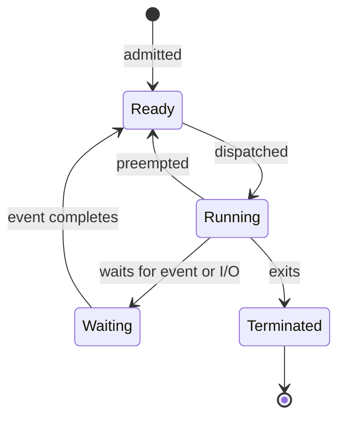
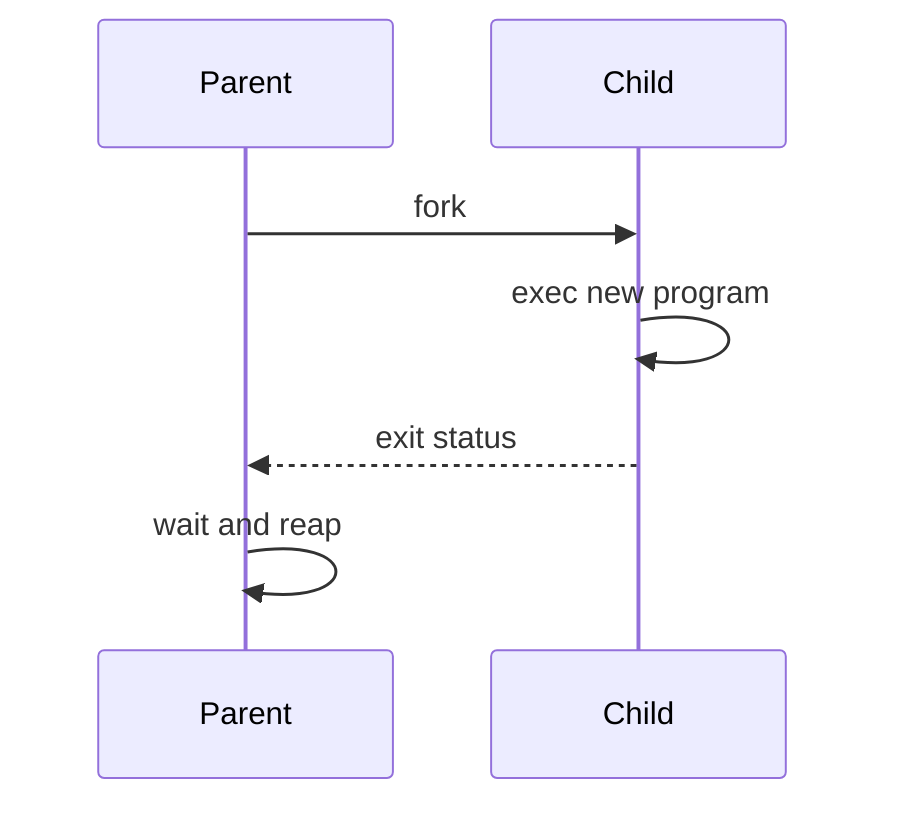

# 02. Processes

> A process is a running program plus the execution and resource state required to manage it.

## Program vs process

| Program | Process |
|---|---|
| Passive executable/data on storage | Active execution instance |
| No current CPU state | Has PC, registers, stack and scheduling state |
| One program can create many instances | Each instance has an identity and resources |

## Typical process address space

| Region | Contains |
|---|---|
| Text/code | Machine instructions, usually read-only |
| Read-only data | Constants and literals |
| Initialized data | Initialized global/static variables |
| BSS | Zero/uninitialized global/static variables |
| Heap | Dynamic allocations; generally grows upward conceptually |
| Mapped area | Shared libraries, files and anonymous mappings |
| Stack | Calls, local variables and saved state; generally grows downward conceptually |

Exact placement and growth direction are platform-dependent.

## Process Control Block (PCB)

The kernel records:

- Process ID and parent/ownership information
- Current state
- Program counter and saved registers
- Scheduling priority/accounting
- Address-space/page-table reference
- Open-file references
- Signals and handlers
- Resource limits and credentials

The PCB is kernel metadata. It is not the same thing as the process's user-space stack.

## Process states

- **Ready:** can run but is waiting for CPU time.
- **Waiting/blocked:** cannot run until an event occurs.
- **Running:** executing on a CPU.
- On an N-core machine, at most N threads execute simultaneously, though many may be ready.

## Context switch

A process/thread context switch generally:

1. Enters the kernel due to interrupt, exception or system call.
2. Saves current registers and scheduling state.
3. Selects another runnable thread.
4. Switches address-space state if required.
5. Restores the selected thread's registers.
6. Returns to its execution.

Costs include kernel work and indirect effects such as disturbed CPU caches, branch predictors and TLB state. A switch between threads of the same process may avoid an address-space switch, but is not free.

## Process creation: `fork`, `exec`, `wait`

### `fork()`

- Creates a child process with a logically duplicated address space.
- Parent receives the child's PID; child receives `0`; failure returns a negative value to the parent.
- Modern systems normally use **copy-on-write**, so physical pages are initially shared read-only and copied only when modified.
- The child inherits copies/references to resources such as file descriptors; exact semantics depend on the resource.

### `exec()`

- Replaces the current process image with a new program.
- PID normally remains the same.
- A successful `exec()` does not return to the old program.
- Open descriptors may survive unless marked close-on-exec.

### `wait()` / `waitpid()`

- Allows a parent to collect a child's termination status.
- Reaps the zombie's remaining kernel bookkeeping.
- Can block or, with appropriate options, poll.

## Zombie, orphan and daemon

| Term | Meaning | Key fact |
|---|---|---|
| Zombie | Child exited but parent has not collected status | No longer executes; retains small kernel record |
| Orphan | Parent exits while child is still running | Re-parented to an appropriate system process/subreaper |
| Daemon | Long-running background service | Usually detached from interactive terminal/session |

Killing a zombie does nothing useful because it is already dead; its parent must reap it or terminate so re-parenting can occur.

## CPU-bound vs I/O-bound

- **CPU-bound:** long compute bursts; performance limited mainly by CPU.
- **I/O-bound:** frequent waits and short CPU bursts; responsive schedulers often favor quick wakeups.
- Multiprogramming improves utilization because another process can run during I/O waits.

## Parent-child resource relationships

After `fork()`:

- Virtual address contents initially appear identical, but address spaces are logically separate.
- File descriptors commonly point to the same underlying open-file description, so file offset/state can be shared.
- Each process has its own descriptor table entries.
- Pending signals and some process attributes have special inheritance rules.

## Process isolation

Page tables prevent ordinary direct access to another process's memory. Controlled sharing requires an OS mechanism such as shared memory or a mapped file. Isolation is limited if processes share privileged credentials or exploit a kernel vulnerability.

## Common traps

- `fork()` does not normally copy every physical page immediately.
- `exec()` creates no new process; it replaces a process image.
- A blocked process is not waiting for the CPU; it is waiting for an event.
- A zombie consumes a PID/table entry, not normal CPU execution.
- Context switch and mode switch are different.
- Parent and child may share an underlying open-file offset after `fork()`.
- Process state is tracked per schedulable execution unit; modern kernels often schedule threads.

## Interview checks

1. Why does `fork()` return two different values?
2. What happens to memory immediately after `fork()`?
3. Explain `fork()` followed by `exec()` and `wait()`.
4. Why do zombies exist at all?
5. What happens if a parent never calls `wait()`?
6. What is saved during a context switch?
7. Ready versus blocked: what event moves each to running/ready?
8. Why is a process switch usually more expensive than a same-process thread switch?
9. What happens to file descriptors across `fork()` and `exec()`?

## 60-second recall

- Process = program + address space + CPU state + kernel-managed resources.
- PCB stores the kernel's process metadata.
- Ready waits for CPU; blocked waits for an event.
- `fork` duplicates logically, COW shares physically, `exec` replaces, `wait` reaps.
- Zombie is exited/unreaped; orphan is running without its original parent; daemon is a service.

## References

- [OSTEP: Processes and Process API](https://pages.cs.wisc.edu/~remzi/OSTEP/)
- [MIT xv6 book and process labs](https://pdos.csail.mit.edu/6.S081/2026/schedule.html)

