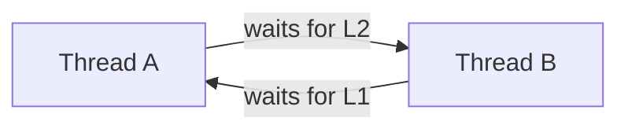

# 07. Deadlocks, Starvation and Livelocks

> A deadlock is a permanent wait cycle: each participant needs something that another participant in the cycle will not release.

## Coffman conditions

All four are necessary for resource deadlock:

1. **Mutual exclusion:** a resource cannot be shared simultaneously.
2. **Hold and wait:** a process holds one resource while requesting another.
3. **No preemption:** resources cannot be forcibly taken away safely.
4. **Circular wait:** a cycle exists in resource dependency.

Breaking any one prevents this class of deadlock.

## Resource-allocation graph

- Process -> resource edge: request.
- Resource -> process edge: allocated instance.
- With one instance of each resource, a cycle implies deadlock.
- With multiple instances, a cycle is necessary but not always sufficient.

A wait-for graph removes resource nodes and shows which process waits for which process; a cycle indicates deadlock in the applicable model.

## Four approaches

| Approach | Idea | Cost/trade-off |
|---|---|---|
| Ignore | Assume rare; recover operationally | Deadlocks can still occur |
| Prevention | Structurally break a Coffman condition | Lower utilization/concurrency |
| Avoidance | Grant only if resulting state is safe | Needs maximum-demand information |
| Detection and recovery | Allow, detect, then recover | Detection overhead and disruptive recovery |

## Prevention examples

- Remove hold-and-wait: request all resources together or release before requesting more.
- Allow preemption where state can be safely rolled back.
- Break circular wait: assign total order to locks and always acquire in that order.
- Mutual exclusion often cannot be removed for inherently exclusive resources.

Global lock ordering is one of the most practical software techniques.

## Avoidance and safe state

- A state is **safe** if some ordering of processes can finish using currently available plus subsequently released resources.
- Unsafe means no guaranteed safe completion sequence.
- **Unsafe does not mean currently deadlocked.** It means future requests could make completion impossible.
- Banker's algorithm models processes declaring maximum demands and grants only requests preserving safety.

Avoidance is uncommon in general application locking because maximum future needs are rarely known.

## Detection and recovery

Detection may inspect a wait-for graph or run a matrix-style completion test. Recovery choices:

- Terminate all involved work
- Terminate selected victim(s)
- Preempt/rollback a resource holder if safe
- Restart a service or transaction

Victim choice can consider priority, progress, resources held and restart cost. Repeatedly choosing the same victim can create starvation.

## Related failures

| Condition | What happens |
|---|---|
| Deadlock | Participants are blocked forever in a dependency cycle |
| Starvation | A participant is repeatedly denied progress while others progress |
| Livelock | Participants keep changing/responding but no useful progress occurs |
| Priority inversion | High-priority work waits on a resource held by lower-priority work |

### Priority inversion

If a low-priority thread holds a lock needed by a high-priority thread, medium-priority work may continually preempt the lock holder. Priority inheritance temporarily boosts the holder so it can release the resource.

## Practical lock discipline

- Define and document a total lock order.
- Avoid callbacks or blocking I/O while holding locks.
- Keep critical sections bounded.
- Use timeouts as detection/containment, not proof of correctness.
- Avoid lock upgrade patterns unless explicitly supported.
- Keep transaction/database locks in the global dependency model.
- Include shutdown paths and error returns when checking lock release.

## Common traps

- A cycle with multi-instance resources does not always prove deadlock.
- Unsafe state is not necessarily deadlocked.
- Timeout breaks waiting but may leave partial work requiring rollback.
- Lock-free algorithms can still livelock or starve individual threads.
- Acquiring all resources upfront prevents hold-and-wait but hurts utilization.
- Starvation can occur without any dependency cycle.

## Interview checks

1. State and explain the four deadlock conditions.
2. Why does lock ordering prevent circular wait?
3. Safe, unsafe and deadlocked states: distinguish them.
4. Deadlock versus starvation versus livelock?
5. Prevention versus avoidance?
6. Why is Banker's algorithm uncommon in application code?
7. Can a timeout solve deadlocks safely?
8. Explain priority inversion and inheritance.
9. How would you diagnose a two-lock deadlock from thread stacks?

## Resume connection: key-value store

Create a lock-order table for:

- Key/value map
- LRU list
- TTL/expiry structure
- Append-only log
- Connection/task queue

Be able to prove that every code path follows the same order and releases locks on errors.

## 60-second recall

- Deadlock needs mutual exclusion, hold-and-wait, no preemption and circular wait.
- Prevent by breaking a condition; avoid by remaining safe; detect/recover after allowing it.
- Unsafe is a warning state, not necessarily a current deadlock.
- Starvation waits while others progress; livelock moves without progress.
- Lock ordering is the most practical prevention rule.

## References

- [OSTEP: Concurrency Bugs](https://pages.cs.wisc.edu/~remzi/OSTEP/)

