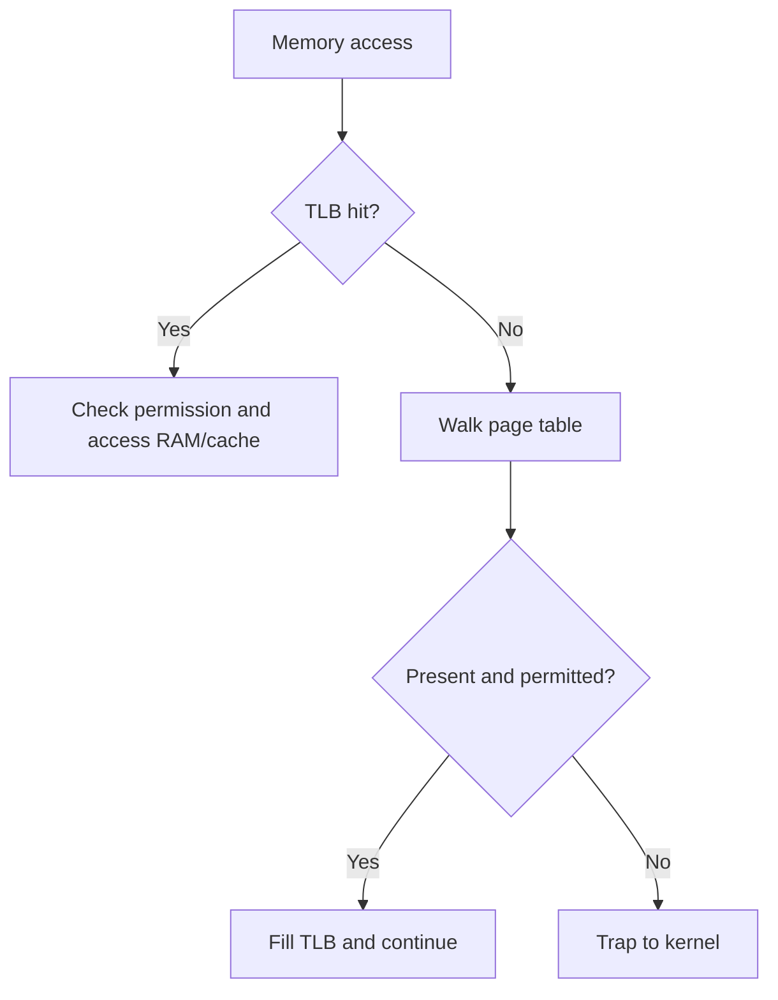

# 09. Paging and Address Translation

> Paging divides virtual memory into fixed-size pages and physical memory into equal-size frames.

## Core translation

A virtual address is split into:

- **Virtual page number (VPN):** identifies a virtual page.
- **Page offset:** position inside the page.

The page table maps VPN to a **physical frame number (PFN)**. The offset is unchanged.

Page size is normally a power of two, so the split is implemented with bits rather than decimal arithmetic.

## Page-table entry (PTE)

A PTE commonly stores:

- Physical frame number
- Present/valid state
- Read/write/execute permissions
- User/kernel accessibility
- Accessed/reference bit
- Dirty/modified bit
- Caching and other architecture-specific attributes

“Valid” can mean part of the process's legal address space, while “present” can mean currently resident in RAM. Exact bit terminology varies by architecture.

## Translation Lookaside Buffer (TLB)

The TLB is a small hardware cache of recent address translations.

- **TLB hit:** translation found without walking the page table.
- **TLB miss:** hardware/software performs a page-table walk.
- If the PTE says the page is present, execution can continue after filling the TLB.
- If the page is not resident or mapping needs OS action, a page fault occurs.

Therefore:

> **TLB miss != page fault.**

## Why page tables become large

A single-level table needs an entry for every virtual page, including unused regions. Sparse address spaces therefore waste page-table memory.

### Multi-level page tables

- Split the VPN into indices for several levels.
- Allocate lower-level tables only for used virtual regions.
- Save memory for sparse spaces.
- May require multiple memory references on a TLB miss.

### Other structures

- **Hashed page table:** hashes virtual-page identity; useful for large sparse address spaces.
- **Inverted page table:** roughly one entry per physical frame rather than per virtual page; reduces table size but complicates lookup/sharing.

## Page-size trade-offs

| Smaller pages | Larger pages |
|---|---|
| Less internal fragmentation | Smaller page tables |
| Finer protection/mapping granularity | Greater TLB reach |
| More page-table entries | Efficient large sequential transfers |
| More TLB pressure | More unused bytes per partially used page |

**TLB reach = number of cached translations × page size** conceptually. Huge pages increase reach but consume/coarsen memory allocation.

## Protection and sharing

- Code pages can be read/execute and not writable.
- Data can be read/write and non-executable.
- Shared libraries can map the same physical frames into many processes.
- Copy-on-write maps shared pages read-only; a write fault creates a private copy.
- Guard pages deliberately remain inaccessible to catch stack overflow or out-of-bounds growth.

## Context switching and TLBs

When switching address spaces, stale translations must not be used for the new process. Architectures handle this through:

- TLB flushes
- Address-space identifiers/tags
- Selective invalidation

When one CPU changes a mapping used by other CPUs, the system may require **TLB shootdown**: notify other cores to invalidate the entry. This is a scalability cost.

## Page-table walk vs page fault

A protection violation may also fault even if the page is physically present.

## Common traps

- Page table is per address space; TLB is a CPU-side cache of translations.
- A TLB miss can be resolved entirely in hardware without OS scheduling.
- Paging removes external fragmentation of physical frame allocation, not internal fragmentation.
- Large virtual address width does not imply equally large RAM.
- Read-only protection faults and not-present faults are different causes.
- Page tables themselves occupy memory and may be paged/mapped through architecture-specific mechanisms.
- Huge pages improve reach but can worsen fragmentation and copy-on-write cost.

## Interview checks

1. Walk through virtual-to-physical translation.
2. TLB miss versus page fault?
3. Why do multilevel page tables save memory?
4. What fields exist in a PTE and why?
5. What happens to the offset during translation?
6. Why can changing a mapping on one core affect other cores?
7. What are page-size trade-offs?
8. How can two processes share one physical code page safely?
9. Why is execute permission independent from read/write permission?

## 60-second recall

- VPN indexes translation metadata; offset passes through unchanged.
- TLB caches translations; page table is the authoritative mapping structure.
- TLB miss triggers a walk; page fault requires exceptional OS handling.
- Multilevel tables allocate structure only for used regions.
- PTEs contain frame identity, residency, permissions, dirty and accessed state.
- Larger pages increase TLB reach but increase allocation granularity/waste.

## References

- [OSTEP: Paging, TLBs and Advanced Page Tables](https://pages.cs.wisc.edu/~remzi/OSTEP/)
- [MIT 6.1810: Page Tables](https://pdos.csail.mit.edu/6.S081/2026/schedule.html)

