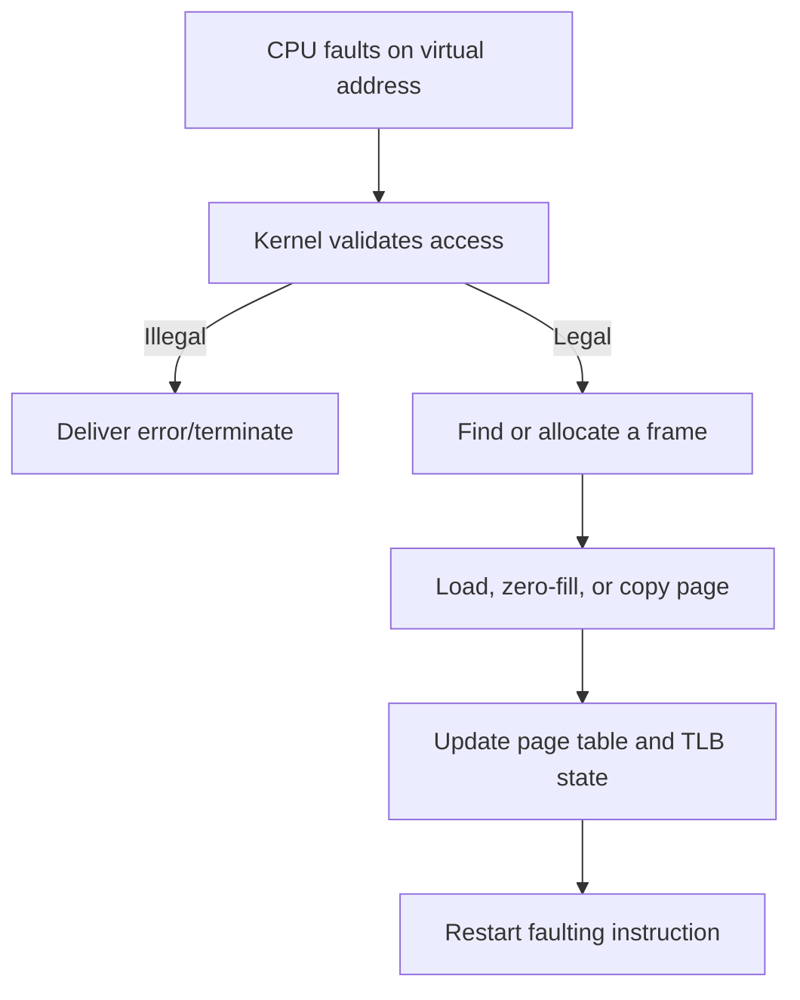

# 10. Virtual Memory

> Virtual memory gives processes large, private address spaces and loads/allocates physical pages according to demand.

## Why virtual memory?

- Isolation between processes and kernel
- Programs larger than immediately available physical memory
- Sparse address spaces
- Shared libraries and shared memory
- Copy-on-write process creation
- File mapping
- Flexible placement without relocating every pointer

Virtual memory is useful even on a machine that never swaps.

## Demand paging

Pages are brought into physical memory when first accessed rather than loading everything upfront.

Benefits:

- Faster startup
- Lower physical-memory usage
- Unused code/data may never be loaded

Costs:

- First-access page-fault latency
- More complex replacement and recovery behavior
- Unpredictable pauses if faults require storage I/O

## Page-fault handling

Possible legal faults:

- Demand-load a file-backed page
- Allocate a zero-filled anonymous page
- Copy a copy-on-write page
- Grow stack within allowed limits

Illegal/protection cases may result in a segmentation/access violation.

## Minor vs major page faults

- **Minor/soft fault:** no storage read required; page may already be cached or require mapping/allocation work.
- **Major/hard fault:** requires storage I/O, usually far slower.

Exact accounting terminology is OS-specific.

## Locality

- **Temporal locality:** recently used data likely reused.
- **Spatial locality:** nearby addresses likely used.
- Programs often execute in working sets, making caching/replacement practical.

## Replacement algorithms

| Algorithm | Idea | Important property |
|---|---|---|
| Optimal | Evict page used farthest in future | Theoretical lower bound; future unknown |
| FIFO | Evict oldest loaded page | Simple; can show Belady's anomaly |
| LRU | Evict least recently used | Uses past as predictor; exact tracking costly |
| Clock/Second Chance | Circular scan using reference bit | Practical approximation to LRU |
| LFU | Evict lowest access count | Old history can dominate; needs aging |

**Belady's anomaly:** with FIFO, adding frames can increase page faults. Stack algorithms such as true LRU and Optimal do not have this anomaly.

## Frame allocation

- **Local replacement:** process replaces its own assigned frames; better isolation.
- **Global replacement:** victim may come from another process; more flexible but creates interference.
- Policies may consider priority, working set and memory pressure.

## Thrashing

Thrashing occurs when active working sets exceed available physical memory, causing repeated faults and little useful execution.

Symptoms:

- High page-fault/storage activity
- Low useful CPU progress
- Large response-time spikes

Adding more runnable processes can worsen thrashing. Responses include reducing multiprogramming, adding memory, controlling working sets or improving locality.

## Copy-on-write (COW)

1. Parent and child initially map the same physical page read-only.
2. Reference counts track sharing.
3. A write triggers a protection fault.
4. Kernel allocates/copies a private page for the writer.
5. Mapping becomes writable.

COW makes `fork()` efficient when the child soon calls `exec()`.

## Memory mapping

- **File-backed mapping:** virtual pages correspond to file contents.
- **Anonymous mapping:** pages are not backed by a named file; may be zero-filled and later swapped.
- **Shared mapping:** writes can be visible to other mappers and may be written back.
- **Private mapping:** modifications are private, generally implemented with COW.

Mapping a file does not guarantee every byte is immediately read, written or durable.

## Swap

- Provides backing storage for evicted anonymous/private memory.
- Swapping a whole process is a classic model; modern systems more commonly move pages.
- Swap expands backing capacity but cannot make storage perform like RAM.
- Excessive swap activity signals memory pressure/thrashing.

## Working set

The working set is the set of pages actively needed over a recent window. Keeping it resident supports progress; allocating far below it causes frequent faults.

## Common traps

- Page fault is a mechanism, not automatically a bug.
- Segmentation fault is an OS-delivered consequence of an invalid/prohibited access; legal page faults are resolved transparently.
- Demand paging is not identical to swapping.
- Virtual memory does not mean “disk used as RAM” only.
- A dirty page needs write-back before reuse if its contents must be preserved; a clean file-backed page can often be dropped.
- More frames do not always reduce FIFO faults.
- COW shares pages until write, not forever.

## Interview checks

1. Walk through a legal page fault.
2. Page fault versus segmentation fault?
3. Why is COW important for `fork()`?
4. Explain thrashing and why adding processes can worsen it.
5. FIFO versus LRU versus Clock?
6. What is Belady's anomaly?
7. Local versus global replacement?
8. File-backed versus anonymous mapping?
9. Shared versus private `mmap` conceptually?
10. Why is a major fault much slower than a minor fault?

## Resume connection: append-only log

Be ready to explain whether your store uses ordinary buffered writes or mapped I/O, when data becomes durable, and how page cache/write-back affects crash claims. “Written by the process” does not necessarily mean “persisted on stable storage.”

## 60-second recall

- Virtual memory supplies isolation, sparse spaces, sharing and flexible allocation.
- Demand paging resolves first access through page faults.
- TLB miss, page fault and segmentation fault are distinct.
- LRU/Clock exploit locality; FIFO can show Belady's anomaly.
- Thrashing means faulting dominates useful work.
- COW delays copies until modification.

## References

- [OSTEP: Swapping Mechanisms and Policies](https://pages.cs.wisc.edu/~remzi/OSTEP/)
- [MIT 6.1810: Page Faults and Copy-on-Write](https://pdos.csail.mit.edu/6.S081/2026/schedule.html)

