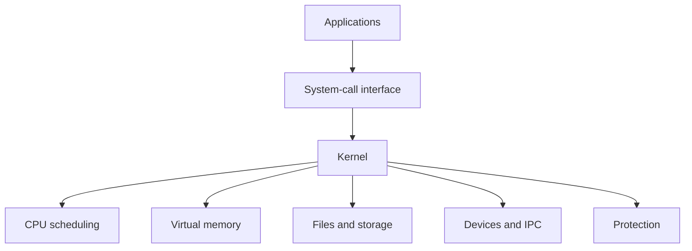
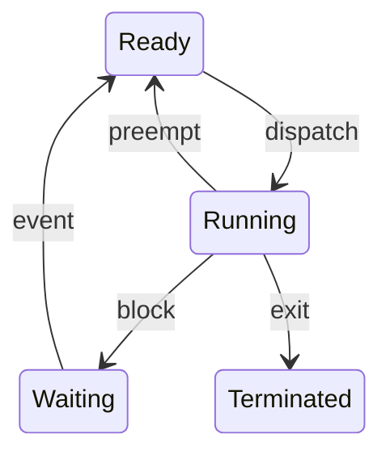
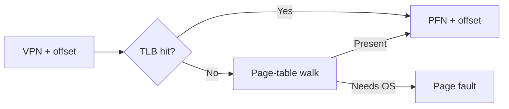

# 19. Operating Systems Final Cheat Sheet

> Last-hour revision. If a line feels unfamiliar, return to the corresponding numbered note.

## OS in one picture



**OS jobs:** abstraction, allocation, isolation and shared services.  
**Core themes:** virtualization, concurrency, persistence.

## Kernel boundary

| Concept | Recall |
|---|---|
| User mode | Restricted application execution |
| Kernel mode | Privileged access to hardware/protected memory |
| System call | Intentional synchronous kernel request |
| Exception/fault | Synchronous condition caused by current instruction |
| Interrupt | Asynchronous hardware notification |
| Mode switch | Privilege changes; same task may continue |
| Context switch | Running thread/process changes |
| Timer | Ensures kernel regains control for preemption |

## Process lifecycle



- PCB: identity, state, registers, scheduling, address space, resources.
- Ready waits for CPU; blocked waits for an event.
- `fork`: create logical copy, usually COW.
- `exec`: replace current process image.
- `wait`: collect child status/reap.
- Zombie: exited/unreaped. Orphan: running, parent exited. Daemon: background service.

## Process vs thread

| Process | Thread |
|---|---|
| Separate address space | Shares address space |
| Stronger isolation | Cheaper sharing |
| IPC for controlled sharing | Ordinary memory sharing |
| Usually costlier switch | Usually cheaper switch |

Threads share code, globals, heap, mappings and descriptors. Each owns PC, registers, stack, scheduling state and TLS.

**Concurrency:** overlapping progress.  
**Parallelism:** simultaneous execution.

## Scheduling flash table

| Algorithm | Key idea | Trap |
|---|---|---|
| FCFS | Arrival order | Convoy effect |
| SJF | Shortest predicted burst | Starvation; future unknown |
| SRTF | Preemptive SJF | More switches/starvation |
| RR | Time quantum | Huge -> FCFS; tiny -> overhead |
| Priority | Highest priority | Starvation/inversion |
| MLFQ | Feedback estimates behavior | Complex tuning |

- Response = arrival to first service.
- Turnaround = arrival to completion.
- Waiting = time in ready queue.
- Aging fights starvation; priority inheritance fights inversion.
- Multicore scheduling balances load against cache affinity.

## IPC selection

| Need | Likely mechanism |
|---|---|
| High-volume same-machine sharing | Shared memory + synchronization |
| Simple parent-child stream | Pipe |
| Discrete local messages | Message queue |
| Bidirectional/local or network | Socket |
| File-backed sharing | Memory mapping |
| Small asynchronous notification | Signal |

- Pipe/TCP are byte streams: define framing.
- Pipe EOF requires every writer descriptor to close.
- Signals notify; handlers must use safe operations.
- Blocking/non-blocking and synchronous/asynchronous are different axes.

## Synchronization decision table

| Primitive | Use when |
|---|---|
| Mutex | General ownership-based critical section |
| Spinlock | Extremely short wait; owner can run; sleeping unsuitable |
| Counting semaphore | Track available units/permits |
| Condition variable | Sleep until protected predicate may be true |
| Reader-writer lock | Measured read-heavy case with worthwhile sections |
| Barrier | Threads must finish a phase together |

Condition-variable pattern:

```text
lock
while predicate is false:
    wait(cv, lock)
use/change state
unlock
```

Remember:

- `x++` is read-modify-write.
- `volatile` is not a general thread-safety mechanism.
- Atomic operation on one variable does not protect a multi-variable invariant.
- Thread-safe individual calls do not make a compound sequence atomic.
- Fine locks increase lock-order/lifetime complexity.

## Deadlock map

Four necessary conditions:

1. Mutual exclusion
2. Hold and wait
3. No preemption
4. Circular wait

| Strategy | Meaning |
|---|---|
| Prevention | Break a necessary condition |
| Avoidance | Grant only if state remains safe |
| Detection | Allow and find cycles/stuck state |
| Recovery | Kill, roll back or preempt safely |

- Strict global lock order breaks circular wait.
- Unsafe state is not necessarily deadlocked.
- Deadlock: blocked cycle. Starvation: repeatedly denied. Livelock: active, no progress.

## Memory management

| Concept | Recall |
|---|---|
| Virtual address | Process-visible address |
| Physical address | RAM location after translation |
| Internal fragmentation | Waste inside allocation |
| External fragmentation | Free holes between allocations |
| Segmentation | Variable logical regions |
| Paging | Fixed-size pages/frames |
| Heap | Dynamic allocations |
| Stack | Call frames/automatic locals |

- Compile/load/execution-time binding determines when addresses become fixed/translated.
- Static linking copies library code; dynamic linking resolves shared libraries.
- `malloc/free` interact with an allocator; they are not one syscall each.
- `free` need not immediately reduce RSS.

## Address translation



- Offset is unchanged.
- PTE: frame, present/valid, permissions, accessed, dirty.
- TLB = cached translations; page table = mapping structure.
- Multilevel tables save metadata for sparse spaces.
- Large pages improve TLB reach but increase allocation granularity/waste.
- TLB shootdown invalidates stale mappings on other cores.

## Virtual memory

Legal page-fault path:

1. Trap to kernel.
2. Validate address and permissions.
3. Allocate/find frame.
4. Load, zero-fill or COW-copy.
5. Update PTE/TLB.
6. Restart instruction.

| Algorithm | Recall |
|---|---|
| Optimal | Future knowledge; theoretical baseline |
| FIFO | Oldest loaded; Belady anomaly possible |
| LRU | Least recently used; exact tracking expensive |
| Clock | Reference-bit approximation |

- TLB miss != page fault != segmentation fault.
- Minor fault avoids storage read; major fault requires I/O.
- Thrashing: working sets exceed RAM, faults dominate work.
- COW: share read-only until first write.
- `mmap`: file-backed or anonymous; shared or private.
- Dirty pages require preservation/write-back; clean file pages can often be dropped.

## Filesystem chain

```text
path -> directory entry -> inode/metadata -> blocks/extents
descriptor -> open-file description -> inode
```

| Concept | Recall |
|---|---|
| Descriptor | Per-process integer handle |
| Open-file description | Offset, status flags, reference count |
| Inode | Metadata and block mapping |
| Hard link | Another name for same file identity |
| Symbolic link | Separate file containing target path |
| Page cache | In-memory file pages |
| Journal | Write-ahead recovery record |

- `fork`-inherited descriptors can share one offset.
- Unlink removes a name; open references may keep file alive.
- Hard links normally cannot cross filesystems; symlinks can dangle.
- `write()` may finish before stable-storage durability.
- Journaling protects consistency according to its mode; it is not backup.
- Log-structured filesystem uses log as primary layout, not just recovery journal.

## I/O and storage

| Method | Recall |
|---|---|
| Polling | CPU repeatedly checks status |
| Interrupt | Device notifies CPU |
| DMA | Controller moves bulk data after CPU setup |
| Buffering | Smooth speed/size mismatch |
| Caching | Retain likely reused data |
| Spooling | Queue jobs for serial device |

- Under very high event rates, batching/polling can beat interrupt-per-event.
- DMA still needs setup, buffers, coherence and completion handling.
- Blocking != synchronous; non-blocking != asynchronous.

Disk algorithms:

- FCFS: fair/simple.
- SSTF: closest, may starve.
- SCAN: sweep both directions.
- C-SCAN: one service direction.
- LOOK/C-LOOK: reverse/jump at last pending request, not physical end.

SSD recall: pages, erase blocks, FTL, garbage collection, wear levelling, TRIM, write amplification.

## RAID flash table

| Level | Core idea | Failure tolerance |
|---|---|---|
| 0 | Striping | None |
| 1 | Mirroring | Usually one per mirror set |
| 5 | Single distributed parity | One disk |
| 6 | Double distributed parity | Two disks |
| 10 | Stripe over mirrors | Depends on failed pairs |

RAID improves availability/performance for specified failures. **RAID is not backup.**

## Top interview traps

1. Syscall does not always schedule another process.
2. Blocked process is not waiting for CPU.
3. `exec` replaces; it does not create.
4. Zombie is already dead.
5. Threads share heap, not stacks.
6. More threads can reduce throughput.
7. Condition notifications do not guarantee predicates.
8. Semaphore count and CV notification semantics differ.
9. Reader operations may mutate metadata, such as LRU order.
10. Unsafe state is not necessarily deadlocked.
11. TLB miss is not a page fault.
12. Page fault is not necessarily an error.
13. Paging still has internal fragmentation.
14. `free` need not return memory immediately to OS.
15. Successful write does not guarantee persistence.
16. Filename is generally in directory entry, not inode.
17. Deleting an open file may not reclaim it immediately.
18. DMA does not mean zero CPU work.
19. SSD removes seek, not all I/O scheduling concerns.
20. RAID and journaling are not backups.

## Resume-specific final check

For your C++ key-value store, be ready to draw and defend:

- Connection -> task queue -> worker thread flow
- Shared structures and exact lock coverage
- Whether GET changes LRU ordering
- TTL eviction race prevention
- Global lock order
- AOF record boundary/checksum/replay behavior
- Acknowledgement vs durability guarantee
- Benchmark workload, machine, throughput and latency percentiles

## Final 30-second answer template

For any OS question:

1. Define the concept precisely.
2. Explain why it exists.
3. Describe the mechanism.
4. State the main trade-off.
5. Give one example or failure case.

Example: “A mutex is an ownership-based mutual-exclusion primitive. It protects an invariant across a critical section. A contending thread usually blocks, so it is better than spinning for longer waits, but excessive lock scope reduces parallelism.”

